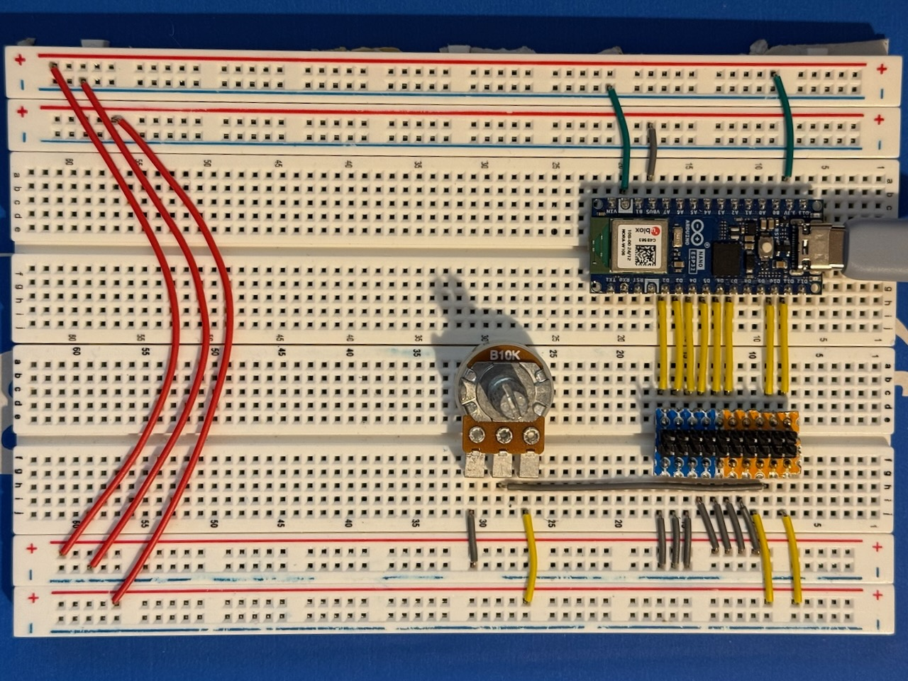

# Train Station Clocks

The clocks in the space. See also Nottingham Hackspace's wiki:

<https://wiki.nottinghack.org.uk/wiki/BigClocks>


## Clock information

* Dimensions: 96 × 26
* Operating voltage: 3.3V
* Power voltage: 5V

## Hardware driver

The microcontroller is a Seeed Studio XIAO ESP32C3.

### Pinout


See [`kicad project`](./kicad) for the latest version.

### Prototype



## Running the project

### Prerequisites

* [PlatformIO](https://platformio.org/) installed

### Installation

Flash the server environment to the device:

```bash
$ pio run -t clean -t upload -e server
```

To run on an SSD1306 OLED display instead, use the `server-oled` environment:

```bash
$ pio run -t clean -t upload -e server-oled
```

For wiring the OLED, connect it to the XIAO ESP32C3 as follows:

| SSD1306 | XIAO ESP32C3 |
|---------|--------------|
| VCC     | 3V3          |
| GND     | GND          |
| SDA     | D4           |
| SCL     | D5           |

### Generation of compatible image data

```bash
$ ./icons/image2bytes.py ./icons/skull.gif
```

### Setting the status of the display

Once flashed, the display will show its IP address. You can then control it via HTTP:

```bash
$ curl http://ip_address:port/ --data '{
  "text": "Repair cafe @\nSheffield Hackspace",
  "text_wrap": false,
  "flashing": false,
  "invert": false,
  "horizontal_align": -1,
  "vertical_align": 0,
  "image": "ABgAAZmAAf+AGf+YH//4DgAwDv/wfH/+fv+uP/UEP1VU8VF39xV/MVX8PV/8cf++f/8eD/+wDgAwH//4Gf+YAf+AAZmAABgA",
  "image_width": 24,
  "image_height": 24
}'
```

| Parameter | Type | Default | Description |
|-----------|------|---------|-------------|
| `text` | string | `""` | The text to display. If too long, the display will scroll it. |
| `text_wrap` | boolean | `true` | If true, overflow scrolls vertically; if false, horizontally. |
| `flashing` | boolean | `false` | If true, inverts colours every second producing a flashing animation. |
| `invert` | boolean | `false` | Invert the colours of the display. |
| `speed` | integer | `5` | Scroll speed. |
| `horizontal_align` | integer | `-1` (left) | -1 left, 0 centre, 1 right. |
| `vertical_align` | integer | `-1` (top) | -1 top, 0 centre, 1 bottom. |
| `image` | string | `""` | Base64-encoded image (output of the image2bytes script). |
| `image_width` | integer | `0` | Image width in pixels. |
| `image_height` | integer | `0` | Image height in pixels. |

### Included libraries

* Adafruit GFX Library - The base for our implementation
* Adafruit BigClock - Provides an Adafruit GFX compatible driver for the display; based on the BigClock library made by the Nottingham Hackspace, heavily rewritten by [`dredzik`](https://typedef.io/)
* Adafruit Widget - Provides a standard way of building a display widget for small IoT screens
