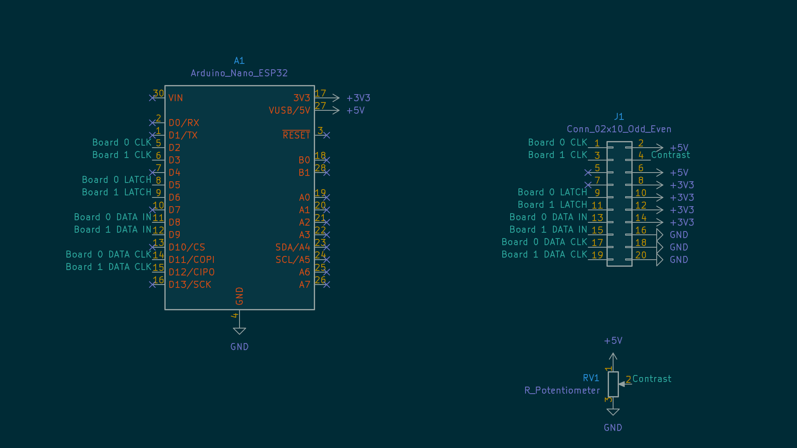

# Train Station Clocks

The clocks in the space. See also Nottingham Hackspace's wiki:

<https://wiki.nottinghack.org.uk/wiki/BigClocks>


## Screen size

96 × 26

## Programming the Arduino

Using Arduino or Platform IO, compile the files in `./src/`.

```bash
# upload Arduino code
pio run -e checkerboard -t upload
pio run -e movingwords -t upload
```

## Components for control

The microcontroller is an Arduino Nano ESP32.

### Pinout



See [`kicad project`](./kicad) for the latest version.

## Libraries

| Library | Version used |
| --- | --- |
| [`Adafruit_BusIO`] | [da6809b582f1b64eeafe44d58df8a90a2fa9b47c][Adafruit_BusIO#at] |
| [`Adafruit-GFX-Library`] | [223f914d0e092cc24723182a2e3273e61c4b22ea][Adafruit-GFX-Library#at] |
| [`BigClockSnake`] | [997af0f0490c7a7ea11e199de90a76a7f8f5caab][BigClockSnake#at] |

[`Adafruit_BusIO`]: https://github.com/adafruit/Adafruit_BusIO
[Adafruit_BusIO#at]: https://github.com/adafruit/Adafruit_BusIO/tree/da6809b582f1b64eeafe44d58df8a90a2fa9b47c
[`Adafruit-GFX-Library`]: https://github.com/adafruit/Adafruit-GFX-Library
[Adafruit-GFX-Library#at]: https://github.com/adafruit/Adafruit-GFX-Library/tree/223f914d0e092cc24723182a2e3273e61c4b22ea
[`BigClockSnake`]: https://github.com/daniel1111/BigClockSnake
[BigClockSnake#at]: https://github.com/daniel1111/BigClockSnake/tree/997af0f0490c7a7ea11e199de90a76a7f8f5caab

The BigClock library has been heavily rewritten by [`dredzik`](https://typedef.io/).
