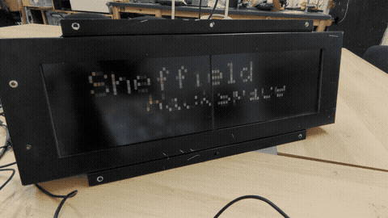
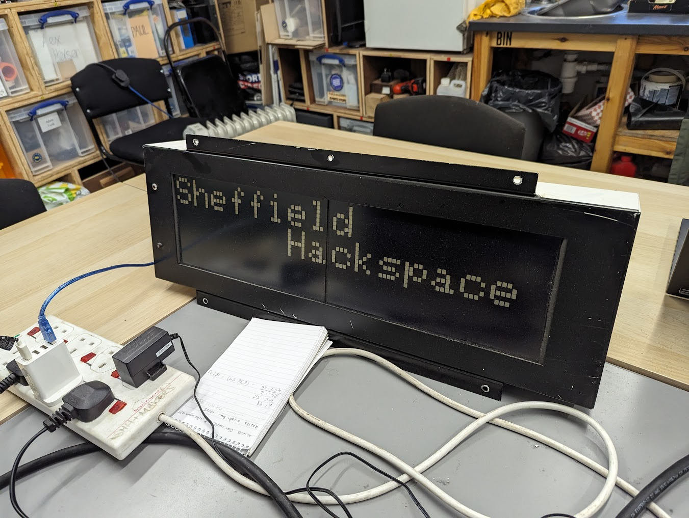
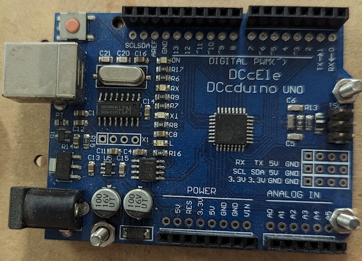
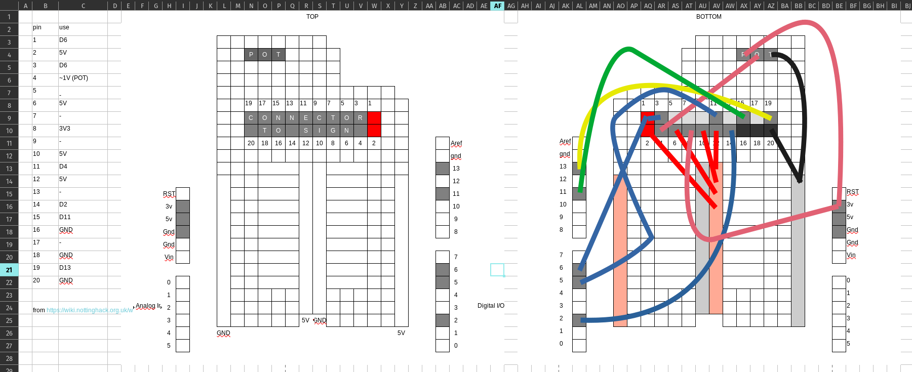

# Train Station Clocks

The clocks in the space. See also Nottingham Hackspace's wiki:

<https://wiki.nottinghack.org.uk/wiki/BigClocks>





## Screen size

96 × 26

## Arduino pins used

| pin | for |
| --- | --- |
| 5V | power |
| 3V3 | power |
| GND | GND |
| 13 | SPI CLOCK |
| 11 | SPI DATA |
| 6 | mysterious square wave |
| 4 | latch/strobe between panels |
| 2 | board select |

## Programming the Arduino

Using Arduino or Platform IO, compile the files in `./src/`.

```bash
# upload Arduino code
pio run -e checkerboard -t upload
pio run -e movingwords -t upload
```

## Components for control

same as <https://github.com/alifeee/bus-signs>, see that.

The microcontroller within is DCcEle DCcduino UNO (basically an Arduino Uno)



### Proto shield

See [`layout.ods`](./layout.ods).



See `BigClock.h` and `Adafruit_GFX.h` libraries for specific functions that can be used.

## Libraries

| Library | Version used |
| --- | --- |
| [`Adafruit_BusIO`] | [da6809b582f1b64eeafe44d58df8a90a2fa9b47c][Adafruit_BusIO#at] |
| [`Adafruit-GFX-Library`] | [223f914d0e092cc24723182a2e3273e61c4b22ea][Adafruit-GFX-Library#at] |
| [`BigClockSnake`] | [997af0f0490c7a7ea11e199de90a76a7f8f5caab][BigClockSnake#at] |
| [`TimerOne`] | [ce0fa0b7965f189925d8b7dbba49d562f7c0a4b3][TimerOne#at] |

[`Adafruit_BusIO`]: https://github.com/adafruit/Adafruit_BusIO
[Adafruit_BusIO#at]: https://github.com/adafruit/Adafruit_BusIO/tree/da6809b582f1b64eeafe44d58df8a90a2fa9b47c
[`Adafruit-GFX-Library`]: https://github.com/adafruit/Adafruit-GFX-Library
[Adafruit-GFX-Library#at]: https://github.com/adafruit/Adafruit-GFX-Library/tree/223f914d0e092cc24723182a2e3273e61c4b22ea
[`BigClockSnake`]: https://github.com/daniel1111/BigClockSnake
[BigClockSnake#at]: https://github.com/daniel1111/BigClockSnake/tree/997af0f0490c7a7ea11e199de90a76a7f8f5caab
[`TimerOne`]: https://github.com/PaulStoffregen/TimerOne
[TimerOne#at]: https://github.com/PaulStoffregen/TimerOne/tree/ce0fa0b7965f189925d8b7dbba49d562f7c0a4b3

The BigClock library has been patched [here](https://github.com/sheffieldhackspace/train-signs/blob/9e5d6421624eaed5d2c0fd0f8e506589eaefdfb0/lib/BigClock/BigClock.cpp#L138-L143).
